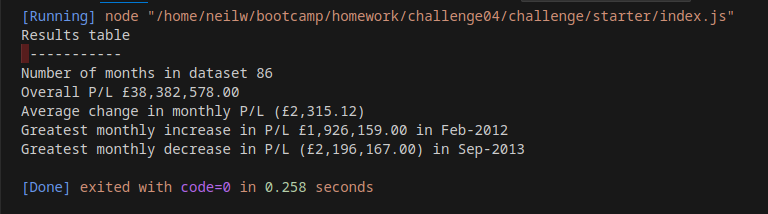

# Console Finances
## Bootcamp challenge 4

This is primarily an excercise in using and traversing arrays in JavaScript, with conditionals to select values that meet certain criteria.

While writing and testing it I did export the data to a .csv file - included n the repository - and made a spreadsheet to check the results of this program against.

## Installation and Usage

The main program is written in JS and simply results in console output when run. It can be directly run using (for example) node.js via the Code Runner extension for VS Code.

If this is not available, opening the index.html page for this challenge and then using the browser's Inspector to open the console allows the results to be viewed.

The GitHub repository for this project is at https://github.com/SirLesP/Console-Finances

The index.html page is published at https://sirlesp.github.io/console-finances/

The program does not take external input, as the provided .js file includes the dataset as an array variable containing key:value pairs for accounting months and the P/L figures for them.

Program output screenshot:

## Enhancements

I have changed the output format, using the en-gb locale to improve the readability of the longer numbers in the output, and apply the accounting convention of placing negative numbers in brackets in documents.

A rewrite using functions could be (slightly) cleaner code. There are array methods for summing the contents of all fields in an array, but they are above my current level of competence so I have not used them.

## Learning outcomes

I'm more confident now with array operations, and more alert to off-by-one errors.

I've also found some useful tools for formatting output neatly.

## License

This excercise does not have a license.

## Copyright

I make no copyright claim for the code, but I do for this README.md document and my comments within the code.
